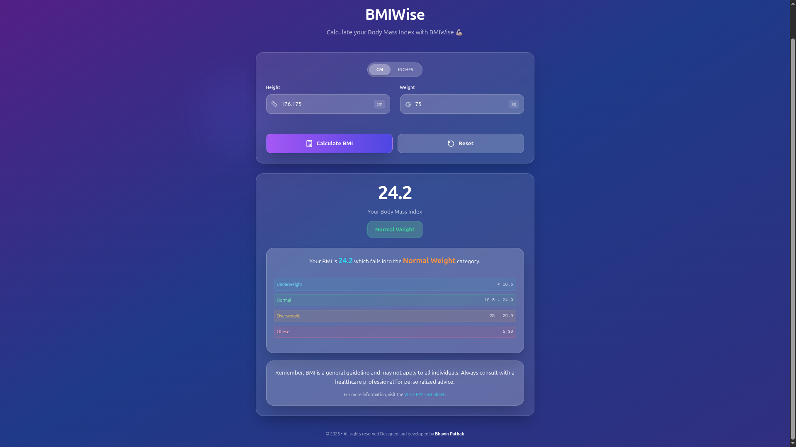

# BMIWise

A modern, responsive Body Mass Index (BMI) calculator built with React and styled with TailwindCSS. This application helps users calculate their BMI and understand their health status with an intuitive, clean interface.



## 🚀 Features

- **BMI Calculation**: Calculate BMI using height (cm) and weight (kg)
- **Health Categories**: Automatic categorization (Underweight, Normal, Overweight, Obese)
- **Input Validation**: Smart validation for positive numbers and realistic ranges
- **Responsive Design**: Works seamlessly on desktop, tablet, and mobile devices
- **Clean UI**: Modern, intuitive interface with smooth animations
- **Health Information**: BMI categories reference and health guidelines
- **Reset Functionality**: Easy reset button to clear all inputs and results

## 🛠️ Tech Stack

- **Frontend Framework**: React
- **Styling**: TailwindCSS
- **Icons**: Lucide React
- **State Management**: React Hooks (useState)
- **Build Tool**: Create React App

## 📦 Installation

### Prerequisites

Make sure you have Node.js (version 14 or higher) installed on your machine.

### Step 1: Clone the Repository

```bash
git clone https://github.com/Bhavin-Pathak/bmiwise.git
cd bitwise
```

### Step 2: Install Dependencies

```bash
npm install
```

### Step 3: Start the Development Server

```bash
npm run dev
```

The application will be available at `http://localhost:3000` (or the port shown in your terminal).

## 📁 Project Structure

```
src/
├── components/
│   ├── BMICalculator.jsx       # Main calculator component
│   ├── GlassCard.jsx          # Glass effect card component
│   ├── ModernInputField.jsx   # Modern input field with glass effect
│   ├── HeightUnitToggle.jsx   # CM/Inches toggle component
│   ├── BMIResult.jsx          # Results display component
│   ├── AnimatedBackground.jsx # Animated background elements
│   ├── Header.jsx             # App header component
│   └── Footer.jsx             # App footer component
├── utils/
│   ├── calculateBMI.js        # BMI calculation logic
│   ├── getBMICategory.js      # BMI categorization logic
│   └── validation.js          # Input validation functions
├── App.jsx                    # Main app component
├── index.css                  # Global styles and Tailwind imports
└── main.jsx                   # Application entry point
```

## 🎯 Usage

1. **Enter Your Height**: Input your height in centimeters (cm)
2. **Enter Your Weight**: Input your weight in kilograms (kg)
3. **Calculate**: Click the "Calculate BMI" button
4. **View Results**: See your BMI value and health category
5. **Reset**: Use the reset button to clear all inputs and start over

## 📊 BMI Categories

| Category      | BMI Range   |
| ------------- | ----------- |
| Underweight   | < 18.5      |
| Normal Weight | 18.5 - 24.9 |
| Overweight    | 25 - 29.9   |
| Obese         | ≥ 30        |

## ✨ Features in Detail

### Input Validation

- Ensures only positive numbers are accepted
- Validates realistic height range (50-300 cm)
- Validates realistic weight range (10-500 kg)
- Shows helpful error messages for invalid inputs

### Responsive Design

- Mobile-first approach
- Optimized for all screen sizes
- Touch-friendly interface
- Smooth animations and transitions

## 🔧 Customization

### Styling

The app uses TailwindCSS for styling. You can customize the appearance by modifying the classes in the components or by extending the Tailwind configuration.

### BMI Calculation Logic

The BMI calculation logic is separated into utility functions for easy maintenance and testing:

```javascript
// src/utils/calculateBMI.js
export const calculateBMI = (weight, height) => {
  const heightInMeters = height / 100;
  return (weight / (heightInMeters * heightInMeters)).toFixed(1);
};
```

## 🧪 Testing

To run tests (if you've added testing):

```bash
npm test
```

## 🚀 Deployment

### Build for Production

```bash
npm run build
```

### Deploy to Popular Platforms

- **Netlify**: Connect your GitHub repository and deploy automatically
- **Vercel**: Perfect for React applications with zero configuration
- **GitHub Pages**: Use `gh-pages` package for easy deployment

## 🤝 Contributing

1. Fork the repository
2. Create your feature branch (`git checkout -b feature/AmazingFeature`)
3. Commit your changes (`git commit -m 'Add some AmazingFeature'`)
4. Push to the branch (`git push origin feature/AmazingFeature`)
5. Open a Pull Request

## 📝 License

This project is licensed under the MIT License - see the [LICENSE](LICENSE) file for details.

## 🙏 Acknowledgments

- Design inspiration from modern health and fitness applications
- Icons provided by [Lucide React](https://lucide.dev/)
- Styling powered by [TailwindCSS](https://tailwindcss.com/)

## 📞 Support

If you have any questions or need help with the application, please:

1. Check the [Issues](https://github.com/Bhavin-Pathak/bmiwise/issues) page
2. Create a new issue if your problem isn't already listed
3. Provide as much detail as possible about the issue

---

**Note**: This BMI calculator is for informational purposes only and should not be used as a substitute for professional medical advice. Always consult with a healthcare provider for personalized health guidance.
